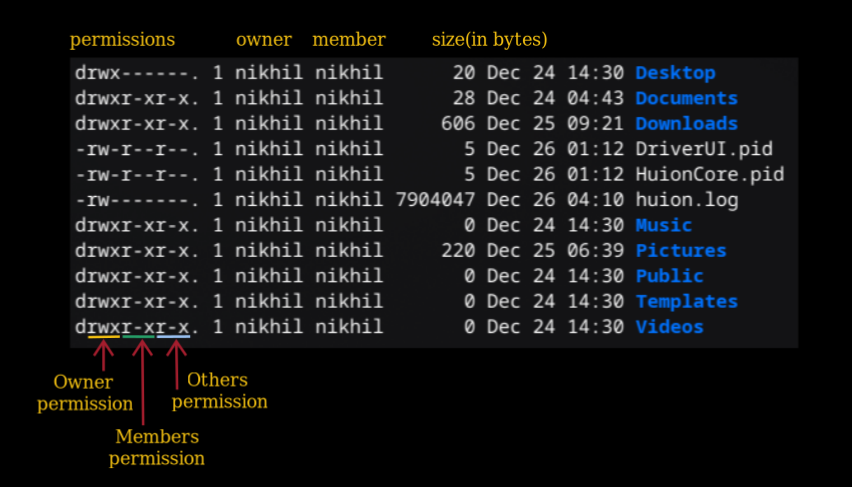

## Shell :
- Shell is the actual one which is communicating with the operating system when we type a command in a terminal. Most linux operating system comes with `bash` as the shell by default but there are other shell options available in the market for example zsh, fish and many more.
- Terminal/Konsole that comes with the distro is not actually the "shell" itself. Instead it's just an application that uses shell behind the scenes to run the commands.

## Commands :
### 1. Check disk usage :
```sh
# df stands for free disk
# -h will display the disk space in Gb Mb which are more readable to human POV
# instead of bytes
df -h

# -i will display i-node usage
df -i
```

### 2. Print current working directory :
```sh
pwd
```
When we open the terminal after logging into the linux, the current working directory is set to `home` directory. 
<br>
**Note**: If multiple user account are present in the linux distro then each user is provided its own `home` directory.

### 3. Listing content of directory :
```sh
ls
ls -l
ls -a
ls -la
```

When we run `ls -l` we get output something like this : 

<br>
- d: directory.
- r: read
- w: write
- x: execute
- 1: number of hardlinks present

for example: `drwxr-xr-x` signifies that the item is a directory, owner of that directroy has read-write-execute permission, group member has read-execute permission and other users also have read-execute permission.

### 4. Change directory :
```sh
cd <directory_name> # move to the mentioned directory
cd ..               # move to previous directory
cd ~                # move to the home directory
cd /                # move to the root directory
```

### 5. Determining file type : 
```sh
file psyo.pdf   # psyo.pdf: PDF document, version 1.4, 758 page(s)

file desk.jpeg  # desk.jpeg: JPEG image data, JFIF standard 1.01
```

### 6. Read text file : 
```sh
less <file_name>
```

