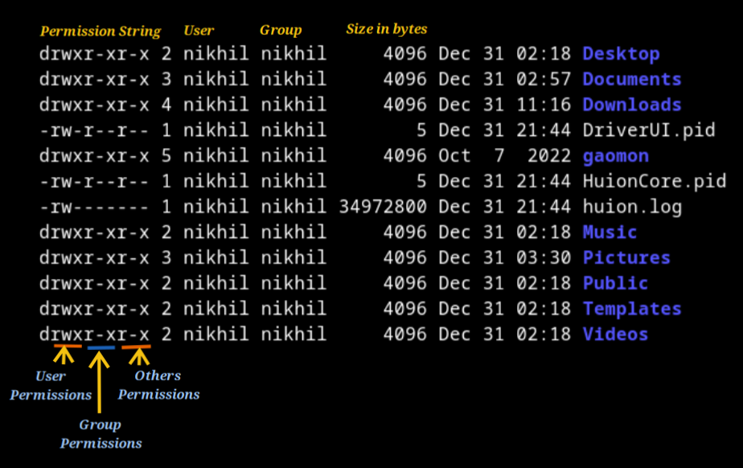

- first character of permission string tells whether the object is a file or directory or a symbolic link.
    - `d` : means its a directory.
    - `l` : means its a symbolic link.
    - `-` : means its a file.
- the next three string character represents `user` permission followed by `group` permission followed by `other` permission.
    - `r` : means it has read permission.
    - `w` : means it has write permission.
    - `x` : means it has execute permission.

```sh
# this will give exec permission to all user i.e anyone can read, write or execute that file/folder. 
$ chmod +x <filename_or_foldername>

# only user will have exec permission
$ chmod u+x <filename_or_foldername>

# only group will have exec permission
$ chmod g+x <filename_or_foldername>

# only other will have exec permission
$ chmod o+x <filename_or_foldername>
```

```sh
# similarly we can also revoke permission
$ chmod -x <filename_or_foldername>

# user exec permission revoked
$ chmod u-x <filename_or_foldername>

# group exec permission revoked
$ chmod g-x <filename_or_foldername>

# other exec permission revoked
$ chmod o-x <filename_or_foldername>
```
- for giving read permission use `r` in place of `x` in above command and for write use `w`.

- we can also use numerical representation to give permission :
    - r: 4
    - w: 2
    - x: 1
```sh
# this means user and group has rwx permission while others have none
$ chmod 770 <filename_or_foldername>

# user have rwx, group has rw and other has r
$ chmod 764 <filename_or_foldername>
```

- change ownership as well as group of a file/folder
```sh
# only superuser can change ownership
$ sudo chown -R <user_name>:<group_name> <file_folder_name>
# only in case of folder we need -R(mean recurrsion) 
```